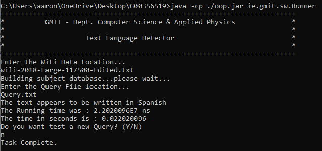

# Language Detector - G00356519

This is my submission for Object Oriented Programming project "Language Detector".

For this project we had to create a program that would Parse text files and Analyse them to detect the language that the text is in.


## Built With
*  [Eclipse](https://www.eclipse.org/) - The IDE used

## Acknowledgments
* Oracle.
* Java 8 doc's.
* Object Oriented Programming Lecture slides.
* StackOverflow when facing issues.

## Running the Jar File
The JAR file was created in the BIN location of the project. 
To run the JAR file on CMD/XTerm use the following commands : 
```
java -cf ./oop.jar ie.gmit.sw.Runner
```

## JavaDocs
My JavaDocs are located within a folder name 'docs'. The documents contain all the details about each of my classes and their methods in a html format.

## Runner
My Runner class is very basic, I created an Object for the UI class and then called its methods to execute the program. The user will be prompted to enter the WiLi DataLocation and the Query text file they wish to analise.

## AnalyseQuery Method
In my analyseQuery() method i am passing the name of the query file which is then read through a buffer line by line. I am then calling the getLanguage() method from the Database to detect the language based off of its frequency values. 

# Extra Innovation

## Running Times
I briefly added nanoTime() code just to test the speed of the programs execution to detect a language based of its file size. At first it was running at lightning fast speeds but as the code had to be changed in specific areas to meet an accurate result this slowed down the running time but by a very small fraction. 

## Testing
I added very basic java prompt questions for the user which allows them to remain testing text files until they wish to stopo by using a (Y/N) sequence.

## Example 

